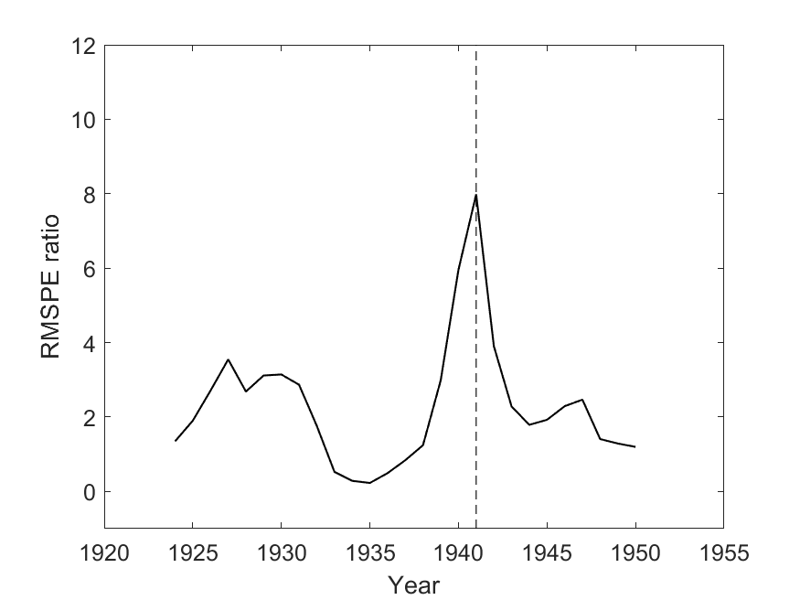

## Figure 1

Figure 1 shows the income of Chile relative to the United States and relative to the average between the average of the Europe 12 countries and the average of the Western Offshoots countries.

The following code produces Figure 1.
All figures are saved in the Figures folder in this repository.

```{r setup, cache=FALSE, warning=FALSE, comment=FALSE, message=FALSE}

source('data_preparation.R')
source('structural_break_tests.R')

ggplot_relative_income()

```

```{r figure_1, echo=FALSE,out.width='49%', out.height='20%',fig.cap='Figure 1: Source: Maddison (2018). Note: The horizontal lines represent the middle-income band. The line above shows the relative income between Chile and the average between Western Offshoots and Western Europe, while the line below shows Chile’s relative income to the US. Western offshoots is the average income of the US, Canada, Australia and New Zealand together, while Western Europe is the average income of the group of countries comprised of: Austria, Belgium, Denmark, Finland, France, Germany, Center-North Italy, Netherlands, Norway, Sweden, Switzerland, and Great Britain.', fig.show='hold', fig.align='center'}

library(knitr)
opts_chunk$set(echo = TRUE)


``` 

## Figure 2

Figure 2 shows structural break tests of the relative income series of Chile and three countries or groups of countries. These figures are shown separately in this section, starting with the the relative income of Chile over the United States, following with the relative income of Chile and the average between the average of the Europe 12 countries and the average of the Western Offshoots countries, and finally against the Nordic 3 countries, the average of Sweden, Norway and Finland.

```{r create_figure_2, results='hide', cache=FALSE, warning=FALSE, comment=FALSE, message=FALSE, error=FALSE}

usa_rel <- get_relative_usa(1820)
#Figure 2_1a
plot_time_series(usa_rel, 'chile_relative', 1820, 'Figure 2_1a')
#Figure 2_1b
plot_Fstat_test(usa_rel, 'chile_relative', 1820, 'Figure 2_1b')

wo_e12 <- average_wo_e12()
#Figure 2_2a
plot_time_series(wo_e12, 'chile_relative', 1880, 'Figure 2_2a')
#Figure 2_2b
plot_Fstat_test(wo_e12, 'chile_relative', 1880, 'Figure 2_2b')

nordic3 <- get_Nordic3_relative()
#Figure 2_3a
plot_time_series(nordic3, 'chile_relative', 1880, 'Figure 2_3a')
#Figure 2_3b
plot_Fstat_test(nordic3, 'chile_relative', 1880, 'Figure 2_3b')

```


```{r figure_2, out.width='49%', out.height='20%',fig.cap='Figure 2: The top left figure shows Chile’s GDP per capita relative to the USA, the middle left shows Chile relative to the simple average of Western Offshoots and Western Europe-12, and the bottom left one shows Chile’s relative to the Nordic-3 countries. The figures on the right show the results of the F statistic to test for a structural break in level as in Zeileis et al. (2012) for each series, assuming relative income is constant. The highest value marks the most likely year for structural break on the series. In this case, 1948 in the bottom case (Nordic-3), while 1940 in the other two. The period considered in the analysis changes as some European countries’ data starts later in the database.', fig.show='hold', fig.align='center'}

include_graphics(c('../figures/Figure 2_1a.png','../figures/Figure 2_1b.png'))
include_graphics(c('../figures/Figure 2_2a.png','../figures/Figure 2_2b.png'))
include_graphics(c('../figures/Figure 2_3a.png','../figures/Figure 2_3b.png'))

``` 

\newpage

## Figure 3

Figures 3, 4 and 5 are results of the synthetic control method, which is implemented in Matlab. To produce these figures execute the script **main_synthetic_controls.m**. We nonetheless attach the images here for consistency.

```{r figure_3, out.width='49%', out.height='20%',fig.cap='Figure 2: The top left figure shows Chile’s GDP per capita relative to the USA, the middle left shows Chile relative to the simple average of Western Offshoots and Western Europe-12, and the bottom left one shows Chile’s relative to the Nordic-3 countries. The figures on the right show the results of the F statistic to test for a structural break in level as in Zeileis et al. (2012) for each series, assuming relative income is constant. The highest value marks the most likely year for structural break on the series. In this case, 1948 in the bottom case (Nordic-3), while 1940 in the other two. The period considered in the analysis changes as some European countries’ data starts later in the database.', fig.show='hold', fig.align='center'}




``` 

## Figure 4

```{r figure_4, out.width='49%', out.height='20%',fig.cap='Figure 2: The top left figure shows Chile’s GDP per capita relative to the USA, the middle left shows Chile relative to the simple average of Western Offshoots and Western Europe-12, and the bottom left one shows Chile’s relative to the Nordic-3 countries. The figures on the right show the results of the F statistic to test for a structural break in level as in Zeileis et al. (2012) for each series, assuming relative income is constant. The highest value marks the most likely year for structural break on the series. In this case, 1948 in the bottom case (Nordic-3), while 1940 in the other two. The period considered in the analysis changes as some European countries’ data starts later in the database.', fig.show='hold', fig.align='center'}

include_graphics(c('../figures/Figure 4_1.png','../figures/Figure 4_2.png'))

``` 

## Figure 5

```{r figure_5, out.width='49%', out.height='20%',fig.cap='Figure 2: The top left figure shows Chile’s GDP per capita relative to the USA, the middle left shows Chile relative to the simple average of Western Offshoots and Western Europe-12, and the bottom left one shows Chile’s relative to the Nordic-3 countries. The figures on the right show the results of the F statistic to test for a structural break in level as in Zeileis et al. (2012) for each series, assuming relative income is constant. The highest value marks the most likely year for structural break on the series. In this case, 1948 in the bottom case (Nordic-3), while 1940 in the other two. The period considered in the analysis changes as some European countries’ data starts later in the database.', fig.show='hold', fig.align='center'}

include_graphics(c('../figures/Figure 5_1.png','../figures/Figure 5_2.png'))

``` 
